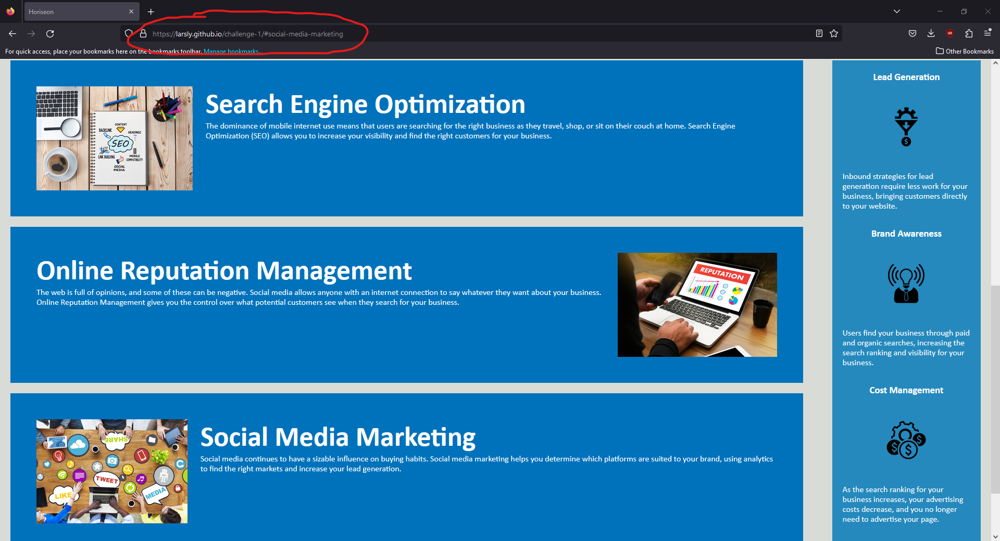

# Horiseon Social Solution Services, Inc. Homepage

## Description

A homepage for Horiseon, a digital marketing company. In the header it includes their business name at the top left and three links at the top right which lead you to more information about their services. The body of the website includes a background image at the top then three articles and an aside. The links at the top jump to their associated article. Each article contains a picture for reference. The aside provides pros to using their services along with three smaller images. The footer contains their copyright information. This website is ADA accesible with alt attributes for images.  

### Skills Used

In this assignment I assigned alt attributes to images to the best of my abbility. The background image in CSS stumped me for a moment, but I found that if you use "title" the tag shows up when you hover over the picture allowing for a screen reader to read your description. I then consolidated the code in CSS that was repeated and assinged elements and classes. At the end I rearranged the code to follow semantic structure. I also changed some styling in the aside in order to give the words proper spacing and bring the block down to match the mock up. Then I made comments explaining the code in CSS. (I'm sorry if it's too much, I wasn't sure what was meant by proper comments) In html I included a descriptive title. Then I rearranged the heading attributes to fall in sequential order. I then added semantic elements and put them in a logical structure. I included id for all links.


## Installation

Install locally with:
```
git clone https://github.com/larsly/challenge-1
```

## Usage

To view the live website go to [https://larsly.github.io/challenge-1/](https://larsly.github.io/challenge-1/)

Click the links to go to specific sections of the web page as seen here.


## Credits

N/A

## License

Please refer to the LICENSE in the repo.